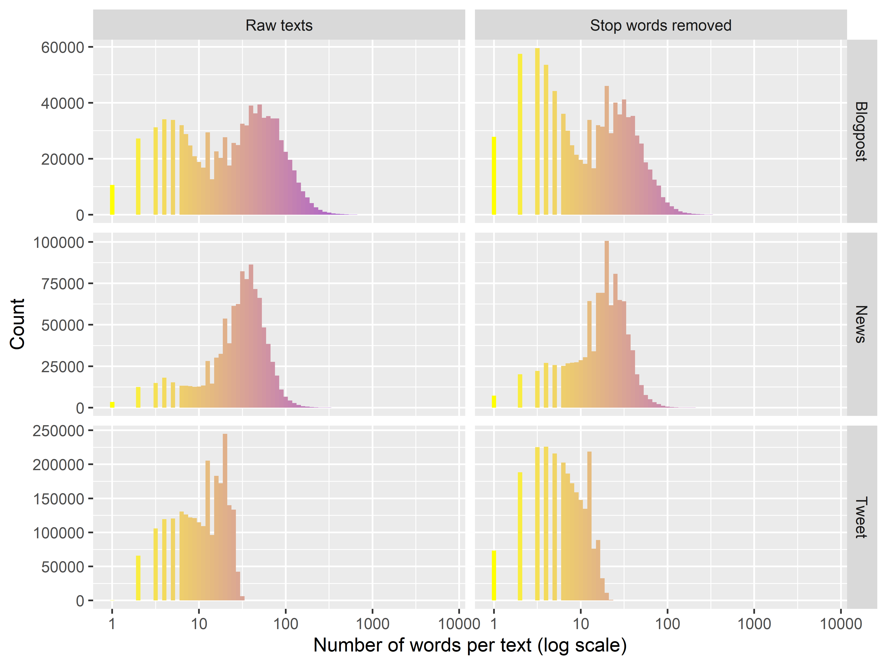
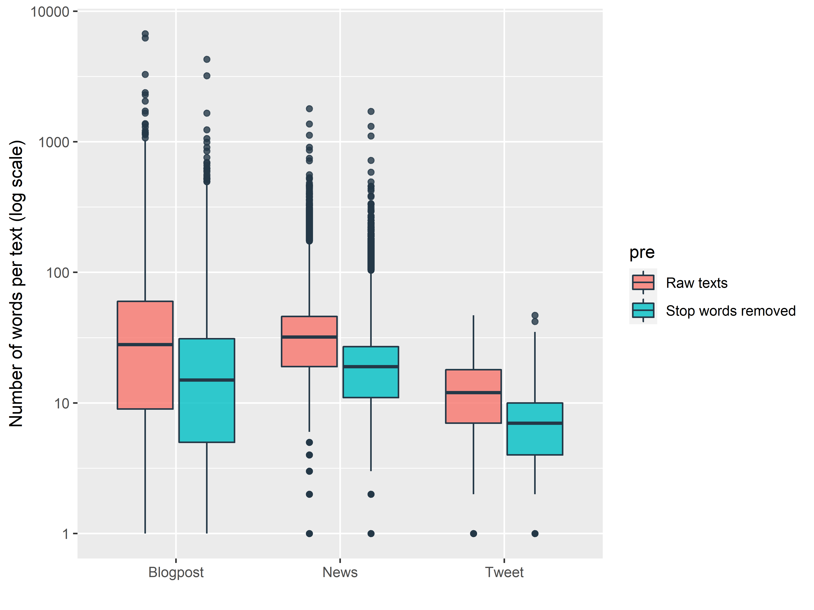
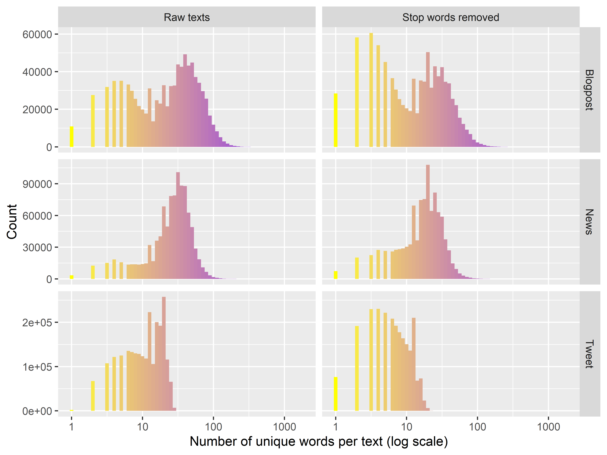
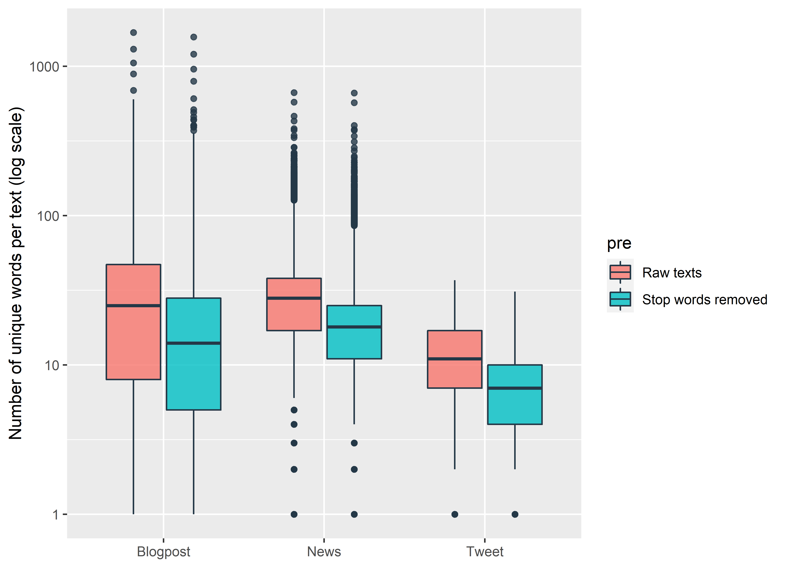

EDA: text mining on blogposts, news and tweets corpora
========================================================
author: Akim van Eersel
date: 2020-12-23
autosize: true


Introduction
========================================================

Presentation made for the second step of the seven for the Data Science Capstone project from Johns Hopkins University Specialization on Coursera.

This report is a quick text mining exploratory data analysis of 3 different text sources:  
* blogposts with `899 288` documents  
* news with `1 010 242` documents  
* tweets with `2 360 148` documents  

First let's see the distribution of all words among the 3 sources for each document.


Number of words: histograms
========================================================




Number of words: boxplots
========================================================




Number of words: conclusion
========================================================

<small>Raw texts five numbers summary:</small>

```
         Min Q1 Median Q3  Max
Blogpost   0  9     28 60 6726
News       1 19     32 46 1796
Tweet      1  7     12 18   47
```

<small>Stop words removed five numbers summary:</small>

```
         Min Q1 Median Q3  Max
Blogpost   1  5     15 31 4295
News       1 11     19 27 1713
Tweet      1  4      7 10   47
```

<small>These numbers show a common trend between all 3 text sources, which is very short message. However, __blogposts__ and __news__ have very far outliers with a tremendous maximum number of words.</small>


Number of words: conclusion
========================================================

<small>First, with stop words removed, distributions among the 3 sources are shifted down quite similarly, which is expected since we're removing the most common words. However, variations seem untouched.

__Tweets__ are limited in number of characters by the platform, so there is a hard limit preventing outliers and force specific message formation.  
On raw documents, there is a predominance in the number of words per message, around 20 words, the rest of documents is spread roughly uniformly.  
However, when stop words are removed, the distribution is very roughly uniform with a decreasing right tail.  
All of these observations aren't surprising. Indeed, since tweets are the only form of message on the social media, messages and responses with few words, like "Ok", as weel as more constructed short sentences coexist. Nonetheless, on raw documents, long sentences seem dominant. But, after stop words removal, these sentences are quite indistinguishable from other shorter tweets.</small>


Number of words: conclusion
========================================================

<small>__Blogposts__ show a bi-modal distribution, or in a different view, a bell-shaped curve centered around 50/60 words with a massive left tail increasing when the number of words is below 15.

__News__ is the more refined distribution with a bell-shaped curve centered around 50 words.</small>

Number of unique characters
========================================================

Now let's see the same distributions but only counting the unique words per document.

Since all documents of all sources are very short, the distributions might be very similar to previous ones.


Number of unique words: histograms
========================================================




Number of unique words: boxplots
========================================================




Number of unique words: conclusion
========================================================

Except for the frequency values, the distributions are almost indistinguishable from the previous ones. So the number of words or unique words does not seem to have a macroscopic impact.

Before ending, let's see the top 10 word pairs (bigrams), without stop words, out of all the documents for each source.


Top 10 bigrams
========================================================


Top 10 bigrams: conclusion
========================================================

#### Top 3 bigrams summary


```
# A tibble: 9 x 2
# Groups:   type [3]
  type     `bigram[1:3]`  
  <chr>    <chr>          
1 Blogpost years ago      
2 Blogpost right now      
3 Blogpost new york       
4 News     year old       
5 News     last year      
6 News     new york       
7 Tweet    right now      
8 Tweet    last night     
9 Tweet    looking forward
```

***

<small>Obviously, most common bigrams are usual pairs or "expressions" (i.e. "looking forward"). However, it's funny to see that city names (New York, St Louis, Los Angeles) are in top 10.</small>
