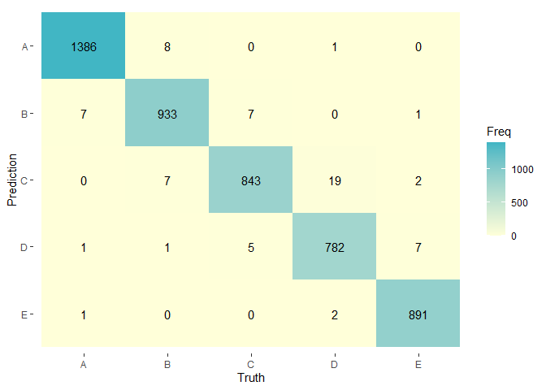

# Synopsis

This report aims to find an appropriate classification model for a human activity recognition in a weight lifting exercises data set. The data for this project come from this source [http://groupware.les.inf.puc-rio.br/har](http://groupware.les.inf.puc-rio.br/har) along the associated paper :  

Velloso, E.; Bulling, A.; Gellersen, H.; Ugulino, W.; Fuks, H. [Qualitative Activity Recognition of Weight Lifting Exercises](http://groupware.les.inf.puc-rio.br/public/papers/2013.Velloso.QAR-WLE.pdf). Proceedings of 4th International Conference in Cooperation with SIGCHI (Augmented Human '13). Stuttgart, Germany: ACM SIGCHI, 2013. 

Different models will be created including all none missing values variables from the training data set and tested with a validation partition step made out of the training set. In conclusion a model trained with bagging method stand out to be the most efficient classifier.

# Analysis

### Load requiered libraries and data set


```r
# Load needed libraries
library(dplyr)
library(ggplot2)
library(dplyr)
library(caret)
library(yardstick)
library(RColorBrewer)
library(MLmetrics)

# Load training/testing data sets
if (!file.exists("data")){
      dir.create("data")
}

if (!(file.exists("./data/pml-training.csv") & file.exists("./data/pml-testing.csv"))){
      
      trainURL <- "https://d396qusza40orc.cloudfront.net/predmachlearn/pml-training.csv"
      testURL <- "https://d396qusza40orc.cloudfront.net/predmachlearn/pml-testing.csv"
      
      download.file(trainURL, destfile = "./data/pml-training.csv", method = "auto")
      download.file(testURL, destfile = "./data/pml-testing.csv", method = "auto")
}

traindf <- read.csv("./data/pml-training.csv")
testdf <- read.csv("./data/pml-testing.csv")
```

### Missing values

In order to take advantage of most of the variables and find the meaningful for prediction, some variables with mostly missing values are probably non relevant and in that sense are removed from the pool.


```r
avgNA <- apply(is.na(traindf), 2, mean)
filt <- avgNA < 0.1
traindf <- traindf[,filt]
testdf <- testdf[,filt]

avgEmpty <- apply(traindf == "", 2, mean)
filt <- avgEmpty < 0.1
traindf <- traindf[,filt]
testdf <- testdf[,filt]

meaningVar <- names(traindf)
```

Also, some variables aren't properly metrics but mostly identifications variables (subjects, timestamps, etc) and won't be removed from the pool but not used for the model.


```r
meaningVar <- names(traindf[,8:ncol(traindf)])
```

### Validation set

A validation partition set is created to compare all further models.


```r
inTrain <- createDataPartition(y = traindf$classe, p = 0.75, list=FALSE)
training <- traindf[inTrain,meaningVar]
validation <- traindf[-inTrain,meaningVar]
```

### Models

Different models will be created including all variables from the training data set, belonging to the most commons family models :  
  - Linear discriminant analysis  
  - Classification tree  
  - Model based prediction with naive Bayes' method  
  - Bagging with classification tree method  
  - Support Vector Machine  
  - Boosting  


```r
modelLda <- train(classe~., data = training, method="lda") # not time-consuming
modelTree <- train(classe~., data = training, method="rpart")  # not time-consuming
modelBayes <- train(classe~., data = training, method="naive_bayes") # not time-consuming
modelBag <- train(classe~., data = training, method="treebag") # medium time-consuming
modelSVM <- train(classe~., data = training, method="svmLinear") # highly time-consuming
modelBoost <- train(classe~., data = training, method="gbm", verbose = FALSE) # extreme time-consuming

predDf <- data.frame(LDA = predict(modelLda, newdata=validation),
                     Tree = predict(modelTree, newdata=validation),
                     Bayes = predict(modelBayes, newdata=validation),
                     Bagging = predict(modelBag, newdata=validation),
                     SVM = predict(modelSVM, newdata=validation),
                     Boosting = predict(modelBoost, newdata=validation))

modelNames <- c("LDA", "Tree", "Bayes", "Bagging", "SVM", "Boosting")
```

Choosing an appropriate model is made by taking the upper evaluation metrics between accuracy, kappa score and f1 score calculated with the validation data set and predicted values for each models.  
Also a time consuming variable is added to evaluation metrics subjectively measured by the relative waiting time before Rstudio was done processing the train function for each model.


```r
truth <- factor(validation$classe)

evalMetrics <- data.frame(
  sapply(predDf, function(elt) round(c(confusionMatrix(elt, truth)$overall[1:2],
                                 F1_score = F1_Score(truth, elt)), 3) ))

comp = data.frame(LDA = "Low", Tree = "Low", Bayes = "Low",
                Bagging = "Medium", SVM = "High", Boosting = "Extreme")

evalMetrics <- as.data.frame(t(rbind(evalMetrics, Computation = comp)))

evalMetrics[order(evalMetrics$Accuracy, decreasing = TRUE),]
```

```
##          Accuracy Kappa F1_score Computation
## Bagging     0.986 0.982    0.994      Medium
## Boosting    0.955 0.943     0.98     Extreme
## SVM         0.777 0.716    0.853        High
## Bayes       0.756 0.693    0.795         Low
## LDA         0.693 0.611    0.795         Low
## Tree        0.482 0.322    0.629         Low
```

Whatever the evaluation metrics, they all point in the same direction for each model. Bagging model with all variables included seems to be a high efficient choice compare to others, even with a similar efficiency model, boosting method but way more slow to process. However, such high efficiency could be due to some bias and over-fitting process.  
Better evaluation metrics could show up with some adequately features pre-processing, especially the tree model could probably be improved. I did few features pre-processing (normalizing, PCA reduction) and tested others classification models but without improvements or meaningless/worst results, so I decided to skip them from this report.   

Nonetheless the bagging model will be the choosing model, it confusion matrix is plotted below.


```r
cols <- brewer.pal(9, "YlGnBu")

cf <- data.frame(labels = factor(validation$classe), pred = predDf$Bagging)
cm <- conf_mat(cf, labels, pred)

autoplot(cm, type = "heatmap") +
  scale_fill_gradient(low=cols[1],high=cols[5]) + theme(legend.position = "right")
```

```
## Scale for 'fill' is already present. Adding another scale for 'fill', which
## will replace the existing scale.
```

<!-- -->

### Predictions

The testing data set variables are used along the classification bagging model to made up some predictions about the unlabeled "Classe" feature.


```r
yhatBag = predict(modelBag, newdata=testdf)
yhatBag
```

```
##  [1] B A B A A E D B A A B C B A E E A B B B
## Levels: A B C D E
```
