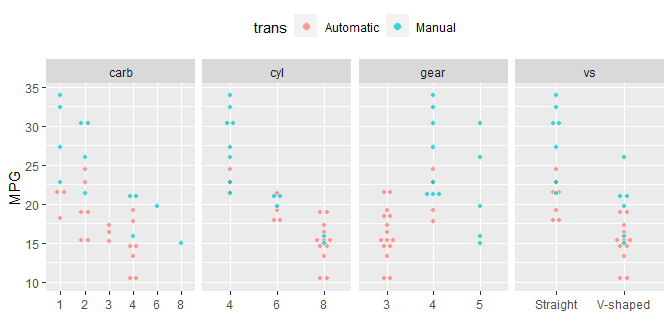
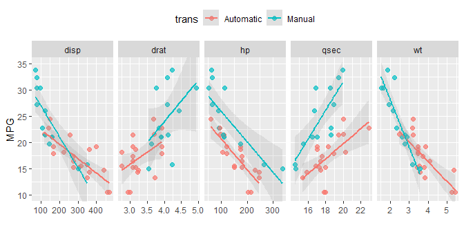
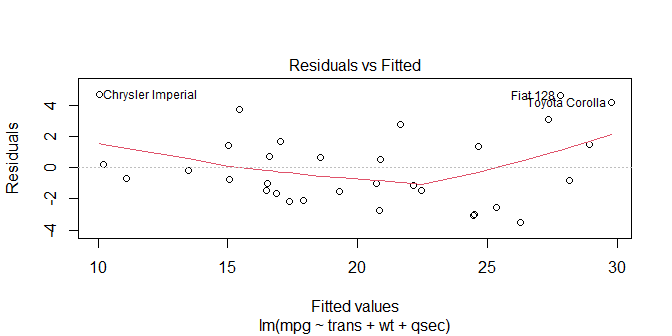
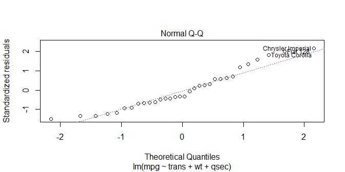

# Synopsis

In this report we aim to answer questions about the potential influence of certain measurable characteristics of car engines on that of MPG (miles per gallon). The problematic concerns the influence of transmission (automatic or manual) and if an influence is measured by how much is it. Our data set included 11 variables (including transmission and mpg) which leads us to a 3 predictors (including transmission) linear regression model. With it, it is then possible to quantify transmission influence. Who turned out to be present and statistically significant with manual transmission impacting more mpg than automatic.

# Analysis

## Load data

### Load requiered libraries and data set


```r
# Load needed libraries
library(dplyr)
library(ggplot2)
library(tidyr)
library(car)
# Load data set
data("mtcars")
```

### Transform data set variable


```r
# Make some categorical variables values more explicit
mtcars['am'] <- sapply(mtcars$am, function(turn) if(turn == 0){'Automatic'}else{'Manual'})
mtcars['vs'] <- sapply(mtcars$vs, function(turn) if(turn == 0){'V-shaped'}else{'Straight'})
# Transform into factors
mtcars <- transform(mtcars, am = factor(am), vs = factor(vs))
# Rename the variable names
mtcars <- rename(mtcars, trans = am)
```

## Summary statistics

### Overview of the data set


```r
# Three first rows
head(mtcars, 3)
```

```
##                mpg cyl disp  hp drat    wt  qsec       vs  trans gear carb
## Mazda RX4     21.0   6  160 110 3.90 2.620 16.46 V-shaped Manual    4    4
## Mazda RX4 Wag 21.0   6  160 110 3.90 2.875 17.02 V-shaped Manual    4    4
## Datsun 710    22.8   4  108  93 3.85 2.320 18.61 Straight Manual    4    1
```

### Overview of variables of interest


```r
# Five number summary of MPG variable
t(data.frame(Statistic = c('Min','Q1','Median','Q3','Max'), Value = fivenum(mtcars$mpg)))
```

```
##           [,1]    [,2]    [,3]     [,4]    [,5]   
## Statistic "Min"   "Q1"    "Median" "Q3"    "Max"  
## Value     "10.40" "15.35" "19.20"  "22.80" "33.90"
```

```r
# Count values of trans variable
table(mtcars$trans)
```

```
## 
## Automatic    Manual 
##        19        13
```

### Exploratory plots


```r
# To make a grid plot with DV: MPG and IVs: others, need a tidy data set

## Separate quantitative and qualitative variables by names
iid_fac <- c("cyl", "vs", "gear", "carb")
iid_quant <- c("disp", "hp", "drat", "wt", "qsec")
## Make a tidy data set with variable name associated with their values
tidydf_fac <- select(mtcars, c(mpg, trans, iid_fac)) %>% 
      gather(key = iid, value = "factor", -c(mpg, trans))
tidydf_quant <- select(mtcars, c(mpg, trans, iid_quant)) %>%
      gather(key = iid, value = "value", -c(mpg, trans))
## Dotplot of MPG against different categorical variables
ggplot(data = tidydf_fac, aes(factor, mpg, fill = trans)) +
      geom_dotplot(binaxis = "y", stackdir = "center", alpha = 0.7, color = "white") +
      facet_grid(.~iid, scales = "free_x") +
      theme(legend.position = "top") + labs(x = "", y = "MPG")
```

<!-- -->

```r
## Scatterplot of MPG against different quantitative variables
ggplot(data=tidydf_quant, aes(x = value, y = mpg, color = trans)) +
      geom_point(cex = 2, alpha = 0.7) + facet_grid(.~iid, scales = "free_x") +
      geom_smooth(method = "lm", alpha = 0.2) + coord_cartesian(ylim = c(10,35)) +
      theme(legend.position = "top") + labs(x = "", y = "MPG")
```

<!-- -->

* __*cyl*__, __*gear*__ and __*drat*__ variables have a strong relationship with __*trans*__, so their prediction is mainly due to knowledge of __*trans*__. However, mpg being the outcome, these variables are probably to be excluded from a multivariate regression model.  

* __*carb*__, __*vs*__ and __*hp*__ seem to be strongly related with __*mpg*__, however __*trans*__ does not seem to discriminate enough to distinguish the two groups. It is necessary to statistically obtain the variance differences to judge the significance of keeping or not these variables in the regression model.

## Regression model

In order to find the best model for __*mpg*__ as outcome with at least __*trans*__ as main predictor, a multivariate linear regression model will be used since half of __mtcars__ data set variables are quantitative. The backward elimination model methodology will be the approach used to obtain the most relevant model.  
To avoid redundancy and meaningless steps, the backward elimination process won't be shown. However, the iterative process goes like this :  

  1. Two boundaries models are set: one with only __*trans*__ predictor, the __simplemodel__, the other with all the __mtcars__ variables as predictors, the __allinmodel__.  
  2. One working in progress model, the __wipmodel__, is set initially identical as the __allinmodel__. It is compared with the other two and according to selection criteria, it is adjusted.  
  3. The main criterion is the __p-value__ calculated for each predictor, directly shown in R with the regression function. The predictor with the highest p-value is removed, with the usual cut-off at 0.05, from the current model, __wipmodel__. Then a new __wipmodel__ model is made with the variable removed and again compared with the reference models.
  4. However, in order to have a better analysis, since the p-value can present biases, other statistics are taken into account:  
    - __Adjusted r-squared__ calculated for the reference models, the model studied and its previous version (before the highest p-value predictor was removed).  
    - An analysis of variance is made to compare each of the models (two referents and before / after current model). The one with the highest __F-statistic__ should be the most relevant.  
    - In addition, the variance inflation (*vif*) is also calculated but more as an indication than as a selection criterion.  

In the best case, each statistical criterion points in the same direction and the choice of a model is unanimous. Otherwise we must try to obtain the predictors with the lowest __p-values__, with an __adjusted r-squared__ model closest to 1, and the largest __F-statistic__.

Below is the first step after removing the __*cyl*__ predictor which had a p-value of 0.91. This led to progress before / after for the model studied, __adjusted r-squared__ from 0.80 to 0.81 and __F-statistic__ from 9.1 to 10.2.


```r
simplemodel <- lm(mpg ~ trans, mtcars)
allinmodel <- lm(mpg ~ trans + cyl + disp + hp + drat + wt + qsec + vs + gear + carb, mtcars)
wipgmodel <- lm(mpg ~ trans + disp + hp + drat + wt + qsec + vs + gear + carb, mtcars)

summary(wipgmodel)$coeff
```

```
##                Estimate  Std. Error    t value   Pr(>|t|)
## (Intercept) 11.34982391 14.49383004  0.7830797 0.44192909
## transManual  2.57742789  1.94034563  1.3283344 0.19768373
## disp         0.01282839  0.01682215  0.7625891 0.45380797
## hp          -0.02190885  0.02091131 -1.0477031 0.30615002
## drat         0.83519652  1.53625251  0.5436584 0.59214373
## wt          -3.69250814  1.83953550 -2.0073046 0.05715727
## qsec         0.84244138  0.68678068  1.2266527 0.23291993
## vsV-shaped  -0.38974986  1.94800204 -0.2000767 0.84325850
## gear         0.71155439  1.36561933  0.5210489 0.60753821
## carb        -0.21958316  0.78855537 -0.2784626 0.78325783
```

```r
c('simplemodel'  = summary(simplemodel)$'adj.r.squared',
  'wipgmodel'   = summary(wipgmodel)$'adj.r.squared',
  'allinmodel' = summary(allinmodel)$'adj.r.squared')
```

```
## simplemodel   wipgmodel  allinmodel 
##   0.3384589   0.8153314   0.8066423
```

```r
anova(simplemodel, wipgmodel, allinmodel)
```

```
## Analysis of Variance Table
## 
## Model 1: mpg ~ trans
## Model 2: mpg ~ trans + disp + hp + drat + wt + qsec + vs + gear + carb
## Model 3: mpg ~ trans + cyl + disp + hp + drat + wt + qsec + vs + gear + 
##     carb
##   Res.Df    RSS Df Sum of Sq       F    Pr(>F)    
## 1     30 720.90                                   
## 2     22 147.57  8    573.32 10.2036 1.014e-05 ***
## 3     21 147.49  1      0.08  0.0114    0.9161    
## ---
## Signif. codes:  0 '***' 0.001 '**' 0.01 '*' 0.05 '.' 0.1 ' ' 1
```

```r
vif(wipgmodel)
```

```
##     trans      disp        hp      drat        wt      qsec        vs      gear 
##  4.332286 20.088643  9.499795  3.118062 14.971795  6.960353  4.454935  4.691536 
##      carb 
##  7.497054
```

```r
# adjrmodel <- lm(mpg ~ trans + disp + hp + drat + wt + qsec, mtcars) 
# adj r² = 0.8347 ; F = 16.25 ; 4 p-values high above 0.05 cutoff

# pmodel <- lm(mpg ~ trans + drat + wt + qsec, mtcars)   
# adj r² = 0.8288 ; F = 26.24 ; p-values low above 0.05 cutoff

# finalmodel <- lm(mpg ~ trans + wt + qsec, mtcars)  
# adj r² = 0.8335 ; F = 39.26 ; p-values low above 0.05 cutoff
```

The best case scenario was not possible here, so we had to find a model that seemed the most appropriate, as explained above. The one retained is the model with __*trans*__, __*wt*__ and __*qsec*__ as the only predictors.  
Better analysis could achieve a different result, in particular by incorporating some interactions between variables (which seems to be the case when we look at EDA). But we'll keep it simple here, and stick with the above model.

To conclude the selection model, let's plot the residuals and the quantiles-quantiles, along a Shapiro-Wilk test, to get a sense about non biased results and normality.


```r
finalmodel <- lm(mpg ~ trans + wt + qsec, mtcars)
# Residuals plot
plot(finalmodel, which = 1)
```

<!-- -->

```r
# QQ plot
plot(finalmodel, which = 2)
```

<!-- -->

```r
# Shapiro test
shapiro.test(finalmodel$residuals)
```

```
## 
## 	Shapiro-Wilk normality test
## 
## data:  finalmodel$residuals
## W = 0.9411, p-value = 0.08043
```

The small sample size isn't in our favor, but the residuals and QQ plots are roughly acceptable, without showing patterns even with minors outliers. It goes the same way with the Shapiro-Wilk test results : the normality hypothesis test is near the boundary of rejection with a 0.08 __p-value__, but still remains acceptable.

## Analysis


```r
summary(finalmodel)$coeff
```

```
##              Estimate Std. Error   t value     Pr(>|t|)
## (Intercept)  9.617781  6.9595930  1.381946 1.779152e-01
## transManual  2.935837  1.4109045  2.080819 4.671551e-02
## wt          -3.916504  0.7112016 -5.506882 6.952711e-06
## qsec         1.225886  0.2886696  4.246676 2.161737e-04
```

```r
confint(finalmodel)
```

```
##                   2.5 %    97.5 %
## (Intercept) -4.63829946 23.873860
## transManual  0.04573031  5.825944
## wt          -5.37333423 -2.459673
## qsec         0.63457320  1.817199
```

The __finalmodel__ shows a *significantly difference* between automatic and manual transmission.  

  1. Between them, there is a 2.93 *[mpg units]* increase in __*mpg*__ going from automatic to manual.  
  2. Moreover, we are 95% confident that the difference of __*mpg*__ going from automatic to manual is in the interval [0.05, 5.83] *[mpg units]*. Which tells us that we are 95% confident that manual transmission increase __*mpg*__ over automatic transmission.
