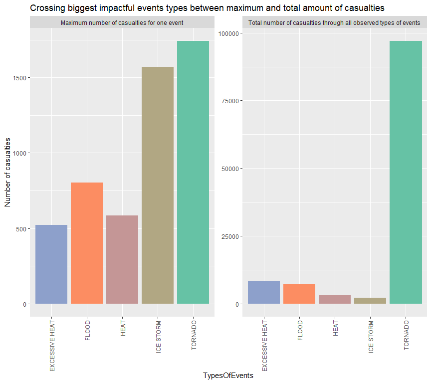
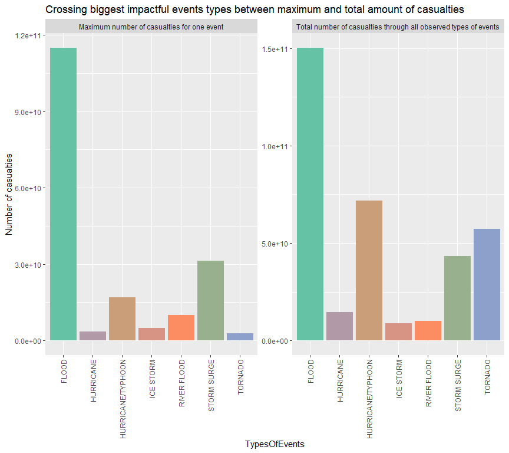

# Synopsis

In this report we aim to describe most impactful population health consequences and economic damages casualties made by storms and other weather events in the United States between 1950 and 2011. From the U.S. National Oceanic and Atmospheric Administration's (NOAA) database we can access the storm data set in order to answer questions about severe weather events. Impactful casualty is defined here as the biggest amount of people touched or economic damages by one weather event. From this setup, for population health consequences it was one tornado with 1742 casualties which was the most harmful event. For economic damages it was one flood with 115 032 500 000$ of damage in total which was the most impactful event. However, two other definitions are explored in this report and results are greatly distinct from previous. One is the proportion of types of weather events impacting population health or economy. The other is the total amount of casualties through all types of events occurred.

# System info

```r
## Overview of session
sessionInfo()
```

```
## R version 4.0.2 (2020-06-22)
## Platform: x86_64-w64-mingw32/x64 (64-bit)
## Running under: Windows 10 x64 (build 19041)
## 
## Matrix products: default
## 
## locale:
## [1] LC_COLLATE=French_France.1252  LC_CTYPE=French_France.1252   
## [3] LC_MONETARY=French_France.1252 LC_NUMERIC=C                  
## [5] LC_TIME=French_France.1252    
## 
## attached base packages:
## [1] stats     graphics  grDevices utils     datasets  methods   base     
## 
## loaded via a namespace (and not attached):
##  [1] compiler_4.0.2  magrittr_1.5    tools_4.0.2     htmltools_0.5.0
##  [5] yaml_2.2.1      stringi_1.4.6   rmarkdown_2.3   knitr_1.29     
##  [9] stringr_1.4.0   xfun_0.16       digest_0.6.25   rlang_0.4.7    
## [13] evaluate_0.14
```

```r
## Rstudio version
rstudioapi::versionInfo()$version
```

```
## [1] '1.3.1073'
```

```r
## Files in working directory
list.files(getwd())
```

```
## [1] "data"               "FinalProject.Rproj" "README.html"       
## [4] "README.md"          "README.Rmd"         "README_cache"      
## [7] "README_files"
```


# Get, Load and Process the Raw Data

## Download data set

Download and store the data file :

```r
## Create a folder to store data set
if (!file.exists("data")){
      dir.create("data")
}

## Download the data set from url source
if (!file.exists("data/Storm Data.bz2")){
      download.file(url = "https://d396qusza40orc.cloudfront.net/repdata%2Fdata%2FStormData.csv.bz2",
                    destfile = "data/Storm Data.bz2")
}

## Check downloading date and file
dateDownloaded <- date()
dateDownloaded
```

```
## [1] "Sun Sep 27 22:18:43 2020"
```

```r
list.files("data")
```

```
## [1] "Storm Data.bz2"
```

## Read the data set

Load the data file, "Storm Data.bz2", previously downloaded :

```r
storm <- read.csv("data/Storm Data.bz2")
```

Overview of the data set :

```r
# Dimensions
dim(storm)
```

```
## [1] 902297     37
```

```r
# Variables names
colnames(storm)
```

```
##  [1] "STATE__"    "BGN_DATE"   "BGN_TIME"   "TIME_ZONE"  "COUNTY"    
##  [6] "COUNTYNAME" "STATE"      "EVTYPE"     "BGN_RANGE"  "BGN_AZI"   
## [11] "BGN_LOCATI" "END_DATE"   "END_TIME"   "COUNTY_END" "COUNTYENDN"
## [16] "END_RANGE"  "END_AZI"    "END_LOCATI" "LENGTH"     "WIDTH"     
## [21] "F"          "MAG"        "FATALITIES" "INJURIES"   "PROPDMG"   
## [26] "PROPDMGEXP" "CROPDMG"    "CROPDMGEXP" "WFO"        "STATEOFFIC"
## [31] "ZONENAMES"  "LATITUDE"   "LONGITUDE"  "LATITUDE_E" "LONGITUDE_"
## [36] "REMARKS"    "REFNUM"
```

```r
# First rows
head(storm, n = 3)
```

```
##   STATE__          BGN_DATE BGN_TIME TIME_ZONE COUNTY COUNTYNAME STATE  EVTYPE
## 1       1 4/18/1950 0:00:00     0130       CST     97     MOBILE    AL TORNADO
## 2       1 4/18/1950 0:00:00     0145       CST      3    BALDWIN    AL TORNADO
## 3       1 2/20/1951 0:00:00     1600       CST     57    FAYETTE    AL TORNADO
##   BGN_RANGE BGN_AZI BGN_LOCATI END_DATE END_TIME COUNTY_END COUNTYENDN
## 1         0                                               0         NA
## 2         0                                               0         NA
## 3         0                                               0         NA
##   END_RANGE END_AZI END_LOCATI LENGTH WIDTH F MAG FATALITIES INJURIES PROPDMG
## 1         0                      14.0   100 3   0          0       15    25.0
## 2         0                       2.0   150 2   0          0        0     2.5
## 3         0                       0.1   123 2   0          0        2    25.0
##   PROPDMGEXP CROPDMG CROPDMGEXP WFO STATEOFFIC ZONENAMES LATITUDE LONGITUDE
## 1          K       0                                         3040      8812
## 2          K       0                                         3042      8755
## 3          K       0                                         3340      8742
##   LATITUDE_E LONGITUDE_ REMARKS REFNUM
## 1       3051       8806              1
## 2          0          0              2
## 3          0          0              3
```

# Insights on variables of interest

## Problematic

The present analysis address the following questions :  
  
      1. Across the United States, which types of events are most harmful with respect to population health ?  
      2. Across the United States, which types of events have the greatest economic consequences ?  
      
* To answer these questions, the common variable of interest is "EVTYPE" for types of events on both questions.  
* Question n°1 deals with "FATALITIES" and "INJURIES" variables to know population health harmful consequences related to each events.  
* Answering the secondary question needs "PROPDMG" and "CROPDMG" variables along with theirs related decimal unit prefix stored in "PROPDMGEXP" and "CROPDMGEXP" variables. These two variables point to the economic amount casualties.

## Analysis

### Population health consequences

#### Data processing

Subset to get only the working variables :

```r
library(dplyr)

health <- storm[, c("EVTYPE", "FATALITIES", "INJURIES")]
```

Add fatalities and injuries variables count to get total amount of population health consequences :

```r
health <- health %>% mutate(Casualties = FATALITIES + INJURIES)
```

Overview of the casualties variable :

```r
summary(health$Casualties)
```

```
##      Min.   1st Qu.    Median      Mean   3rd Qu.      Max. 
##    0.0000    0.0000    0.0000    0.1725    0.0000 1742.0000
```

```r
# Proportion of harmless events without types distinction :
mean(health$Casualties == 0)
```

```
## [1] 0.9756965
```

```r
# Summary of harmful events without types distinction :
summary(health$Casualties[health$Casualties != 0])
```

```
##     Min.  1st Qu.   Median     Mean  3rd Qu.     Max. 
##    1.000    1.000    2.000    7.099    4.000 1742.000
```

Now, the data is grouped by types of events and calculations made to get questioning results :

```r
# Group by types of events
byEvtype <- health %>% group_by(EVTYPE)

# Aggregate by types of events with their related maximum number of casualties and proportion of events with at least one casualty
summaryzero <- summarize(byEvtype, maxCasu = max(Casualties),
                         totalCasu = sum(Casualties),
                         propHarmEvent = sum(Casualties != 0)/n(),
                         numEvent = n())
```

```
## `summarise()` ungrouping output (override with `.groups` argument)
```

Show top 10 of impactful events with the above processed data :

```r
# Show the above result by descending order :
## 1. maximum number of casualties made by one event for each types of events
ansmax <- arrange(summaryzero[summaryzero$maxCasu !=0,],
                  desc(maxCasu), desc(totalCasu))
ansmax
```

```
## # A tibble: 220 x 5
##    EVTYPE            maxCasu totalCasu propHarmEvent numEvent
##    <chr>               <dbl>     <dbl>         <dbl>    <int>
##  1 TORNADO              1742     96979        0.131     60652
##  2 ICE STORM            1569      2064        0.0474     2006
##  3 FLOOD                 802      7259        0.0162    25326
##  4 HURRICANE/TYPHOON     787      1339        0.295        88
##  5 HEAT                  583      3037        0.272       767
##  6 EXCESSIVE HEAT        521      8428        0.404      1678
##  7 BLIZZARD              390       906        0.0316     2719
##  8 HEAT WAVE             202       481        0.405        74
##  9 TROPICAL STORM        201       398        0.0609      690
## 10 HEAVY SNOW            185      1148        0.0120    15708
## # ... with 210 more rows
```

```r
## 2. proportion of types of events with at least one casualty
ansprop <- arrange(summaryzero[summaryzero$propHarmEvent !=0,],
                  desc(propHarmEvent), desc(maxCasu))
ansprop
```

```
## # A tibble: 220 x 5
##    EVTYPE                     maxCasu totalCasu propHarmEvent numEvent
##    <chr>                        <dbl>     <dbl>         <dbl>    <int>
##  1 Heat Wave                       70        70             1        1
##  2 TROPICAL STORM GORDON           51        51             1        1
##  3 SNOW/HIGH WINDS                 34        36             1        2
##  4 THUNDERSTORMW                   27        27             1        1
##  5 TORNADOES, TSTM WIND, HAIL      25        25             1        1
##  6 HIGH WIND AND SEAS              23        23             1        1
##  7 HEAT WAVE DROUGHT               19        19             1        1
##  8 WINTER STORM HIGH WINDS         16        16             1        1
##  9 GLAZE/ICE STORM                 15        15             1        1
## 10 COLD AND SNOW                   14        14             1        1
## # ... with 210 more rows
```

```r
## 3. total amount casualties for each types of events
anstot <- arrange(summaryzero[summaryzero$totalCasu !=0,],
                   desc(totalCasu), desc(maxCasu))
anstot
```

```
## # A tibble: 220 x 5
##    EVTYPE            maxCasu totalCasu propHarmEvent numEvent
##    <chr>               <dbl>     <dbl>         <dbl>    <int>
##  1 TORNADO              1742     96979       0.131      60652
##  2 EXCESSIVE HEAT        521      8428       0.404       1678
##  3 TSTM WIND              60      7461       0.0133    219940
##  4 FLOOD                 802      7259       0.0162     25326
##  5 LIGHTNING              51      6046       0.210      15754
##  6 HEAT                  583      3037       0.272        767
##  7 FLASH FLOOD           159      2755       0.0172     54277
##  8 ICE STORM            1569      2064       0.0474      2006
##  9 THUNDERSTORM WIND      70      1621       0.00826    82563
## 10 WINTER STORM          170      1527       0.0199     11433
## # ... with 210 more rows
```

Since most of 10th impactful types of events are present both in summary tables of maximum and total number of casualties, let's compare the two variables with the intersecting data.  
For better comparison, a plot is made :

```r
library(tidyr)
library(ggplot2)
library(RColorBrewer)

# Make tidy data set to make easier plotting :
interdata <- ansmax[1:10, c("EVTYPE", "maxCasu", "totalCasu")][ansmax$EVTYPE[1:10] %in% anstot$EVTYPE[1:10],]
colnames(interdata) <- c("TypesOfEvents", "Maximum number of casualties for one event", "Total number of casualties through all observed types of events")
tidyInterdata <- gather(interdata, key = countingMethod, value = count, -TypesOfEvents)

# Plot :
pal <- colorRampPalette(brewer.pal(3,"Set2"))

g <- ggplot(tidyInterdata, aes(TypesOfEvents, count))
g + geom_col(fill = c(pal(5),pal(5))) + facet_wrap(.~countingMethod, scales = "free") + 
  theme(axis.text.x = element_text(angle = 90, vjust = 0.5, hjust=1)) +
  labs(title = "Crossing biggest impactful events types between maximum and total amount of casualties") + 
  labs(y = "Number of casualties")
```

<!-- -->


#### Results

The above results show different types of answer:  
 
      1. One is dealing with the maximum number of casualties, "maxCasu" variable. In that sense, one **tornado** event is the most harmful with the biggest event doing 1742 casualties.  
      
      2. The second is dealing with the propotion of types of events with at least one casualty, "popHarmEvent" variable. This result is skewed since most of the bigger proportion variable values are related to few events types occurences. By consequence, "popHarmEvent" top 10 have just one of each type of event observed. In that sense, **heat wave** is the most harmful event with 70 casualties in only one apparition in the data base. Also, the data labels could be miss leading since **heat wave drought** is another type of event and can be found in the same "popHarmEvent" top 10 results, on position 7 with 19 casualties. If needed, clustering labels could avoid to many distinction between similar labels. 
      
      3. Last one is dealing with the total amount of casualties through all occurred events in the database, "totalCasu" variable. In that sense, **tornado** is again the most harmful with a total of 96 979 casualties through 60 652 occurrences.  

Since the analysis is focused on the addition of injuries and fatalities, a deeper analysis could find more precision by doing the same process with distinction between casualties. Other calculations could be made to define harmful casualties, like the total amount of casualties by events types or the related proportion.

### Economic consequences

This process analysis is mostly identical to the previous one.

#### Data processing

Subset to get only the working variables :

```r
econ <- storm[, c("EVTYPE", "PROPDMG", "CROPDMG", "PROPDMGEXP", "CROPDMGEXP")]
```

With related unit prefix variables get the explicit number of economic amount casualties :

```r
# Types of prefix
table(econ$PROPDMGEXP)
```

```
## 
##             -      ?      +      0      1      2      3      4      5      6 
## 465934      1      8      5    216     25     13      4      4     28      4 
##      7      8      B      h      H      K      m      M 
##      5      1     40      1      6 424665      7  11330
```

```r
table(econ$CROPDMGEXP)
```

```
## 
##             ?      0      2      B      k      K      m      M 
## 618413      7     19      1      9     21 281832      1   1994
```

```r
# Replace prefix nomination as a related decimal unit multiplication variable
multipre <- function(prefix){
      if (prefix == "" | prefix == 0){
            1
      } else if (prefix == "K" | prefix == "k") {
            10^3
      } else if (prefix == "M" | prefix == "m"){
            10^6
      } else if (prefix == "B" | prefix == "b"){
            10^9
      } else if (!is.na(as.numeric(prefix))){
            as.numeric(prefix)
      } else {
            0
      }
}
econ <- econ %>% mutate(PropMulti = sapply(PROPDMGEXP, multipre), CropMulti = sapply(CROPDMGEXP, multipre))
```

The above code is subjective to interpretation since some prefix in the data set are outside of the range specified by the [Storm Data Documentation](https://d396qusza40orc.cloudfront.net/repdata%2Fpeer2_doc%2Fpd01016005curr.pdf), which is quoted as :  
> Alphabetical characters used to signify magnitude include “K” for thousands, “M” for millions, and “B” for billions.   

Add fatalities and injuries variables count to get total amount of population health consequences :

```r
econ <- econ %>% mutate(Casualties = PROPDMG*PropMulti + CROPDMG*CropMulti)
```

Overview of the casualties variable :

```r
summary(econ$Casualties)
```

```
##     Min.  1st Qu.   Median     Mean  3rd Qu.     Max. 
## 0.00e+00 0.00e+00 0.00e+00 5.28e+05 1.00e+03 1.15e+11
```

```r
# Proportion of harmless events :
mean(econ$Casualties == 0)
```

```
## [1] 0.7284508
```

```r
# Without harmless events :
summary(econ$Casualties[econ$Casualties != 0])
```

```
##      Min.   1st Qu.    Median      Mean   3rd Qu.      Max. 
## 0.000e+00 3.000e+03 1.000e+04 1.944e+06 5.000e+04 1.150e+11
```

Now, the data is grouped by types of events and 

```r
# Group by types of events
byEvtype <- econ %>% group_by(EVTYPE)

# Aggregate by types of events with their related maximum number of casualties and proportion of events with at least one casualty
summaryzero <- summarize(byEvtype, maxCasu = max(Casualties),
                         totalCasu = sum(Casualties),
                         propHarmEvent = sum(Casualties != 0)/n(),
                         numEvent = n())
```

```
## `summarise()` ungrouping output (override with `.groups` argument)
```

Show top 10 of impactful events with the above processed data :

```r
# Show the above result by descending order :
## 1. maximum number of casualties made by one event for each types of events
ansmax <- arrange(summaryzero[summaryzero$maxCasu !=0,],
                  desc(maxCasu), desc(totalCasu))
ansmax
```

```
## # A tibble: 428 x 5
##    EVTYPE                 maxCasu     totalCasu propHarmEvent numEvent
##    <chr>                    <dbl>         <dbl>         <dbl>    <int>
##  1 FLOOD             115032500000 150319678257          0.397    25326
##  2 STORM SURGE        31300000000  43323541000          0.663      261
##  3 HURRICANE/TYPHOON  16930000000  71913712800          0.795       88
##  4 RIVER FLOOD        10000000000  10148404500          0.613      173
##  5 TROPICAL STORM      5150000000   8382236550          0.590      690
##  6 ICE STORM           5000500000   8967041360          0.333     2006
##  7 WINTER STORM        5000000000   6715441251          0.121    11433
##  8 STORM SURGE/TIDE    4000000000   4642038000          0.318      148
##  9 HURRICANE           3500000000  14610229010          0.707      174
## 10 TORNADO             2800000000  57352114398.         0.649    60652
## # ... with 418 more rows
```

```r
## 2. proportion of types of events with at least one casualty
ansprop <- arrange(summaryzero[summaryzero$propHarmEvent !=0,],
                  desc(propHarmEvent), desc(maxCasu))
ansprop
```

```
## # A tibble: 428 x 5
##    EVTYPE                        maxCasu  totalCasu propHarmEvent numEvent
##    <chr>                           <dbl>      <dbl>         <dbl>    <int>
##  1 TORNADOES, TSTM WIND, HAIL 1602500000 1602500000             1        1
##  2 WILD FIRES                  619000000  624100000             1        4
##  3 HAILSTORM                   220000000  241000000             1        3
##  4 EXCESSIVE WETNESS           142000000  142000000             1        1
##  5 HURRICANE OPAL/HIGH WINDS   110000000  110000000             1        1
##  6 River Flooding              105580000  134175000             1        5
##  7 COLD AND WET CONDITIONS      66000000   66000000             1        1
##  8 WINTER STORM HIGH WINDS      65000000   65000000             1        1
##  9 HIGH WINDS/COLD              55000000  117500000             1        5
## 10 HURRICANE EMILY              50000000   50000000             1        1
## # ... with 418 more rows
```

```r
## 3. total amount casualties for each types of events
anstot <- arrange(summaryzero[summaryzero$totalCasu !=0,],
                   desc(totalCasu), desc(maxCasu))
anstot
```

```
## # A tibble: 428 x 5
##    EVTYPE                 maxCasu     totalCasu propHarmEvent numEvent
##    <chr>                    <dbl>         <dbl>         <dbl>    <int>
##  1 FLOOD             115032500000 150319678257         0.397     25326
##  2 HURRICANE/TYPHOON  16930000000  71913712800         0.795        88
##  3 TORNADO             2800000000  57352114398.        0.649     60652
##  4 STORM SURGE        31300000000  43323541000         0.663       261
##  5 HAIL                1800000000  18758221636.        0.0900   288661
##  6 FLASH FLOOD         1000000000  17562129655.        0.381     54277
##  7 DROUGHT             1000000000  15018672000         0.107      2488
##  8 HURRICANE           3500000000  14610229010         0.707       174
##  9 RIVER FLOOD        10000000000  10148404500         0.613       173
## 10 ICE STORM           5000500000   8967041360         0.333      2006
## # ... with 418 more rows
```

Since most of 10th impactful types of events are present both in summary tables of maximum and total number of casualties, let's compare the two variables with the intersecting data.  
For better comparison, a plot is made :

```r
library(tidyr)
library(ggplot2)
library(RColorBrewer)

# Make tidy data set to make easier plotting :
interdata <- ansmax[1:10, c("EVTYPE", "maxCasu", "totalCasu")][ansmax$EVTYPE[1:10] %in% anstot$EVTYPE[1:10],]
colnames(interdata) <- c("TypesOfEvents", "Maximum number of casualties for one event", "Total number of casualties through all observed types of events")
tidyInterdata <- gather(interdata, key = countingMethod, value = count, -TypesOfEvents)

# Plot :
pal <- colorRampPalette(brewer.pal(3,"Set2"))

g <- ggplot(tidyInterdata, aes(TypesOfEvents, count))
g + geom_col(fill = c(pal(7),pal(7))) + facet_wrap(.~countingMethod, scales = "free") + 
  theme(axis.text.x = element_text(angle = 90, vjust = 0.5, hjust=1)) + 
  labs(title = "Crossing biggest impactful events types between maximum and total amount of casualties") + 
  labs(y = "Number of casualties")
```

<!-- -->

#### Results

Same as the previous section, the above results show two different types of answer:  
 
      1. One is dealing with the maximum number of dollars of damage on property and crops, "maxCasu" variable. In that sense, **flood** events are the most impactful with the biggest event doing 115 032 500 000$ of damage.  
      
      2. The other is dealing with the propotion of types of events with at least one casualty, "popHarmEvent" variable. This result is skewed since most of the bigger proportion variable values are related to few events types occurences. By consequence, "popHarmEvent" top 10 have few type of event observed. In that sense, the aggreagte **tornadoes, tstm wind, hail** is the most harmful event(s) with 1 602 500 000$ of damage.
      
            3. Last one is dealing with the total amount of economic damages through all occurred events in the database, "totalCasu" variable. In that sense, **flood** is again the most harmful with a total of 150 319 678 257$ of damage through 15 326 occurrences. It is interesting to note that 76% of this amount is due only to a single event, the one mentioned in point 1 above.

Since the analysis is focused on the addition of property and crops damages, a deeper analysis could find more precision by doing the same process with distinction between the two variables. Other calculations could be made to define harmful casualties, like the total amount of casualties by events types or the related proportion.
