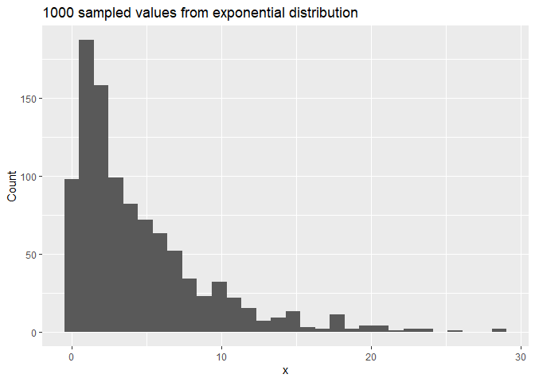
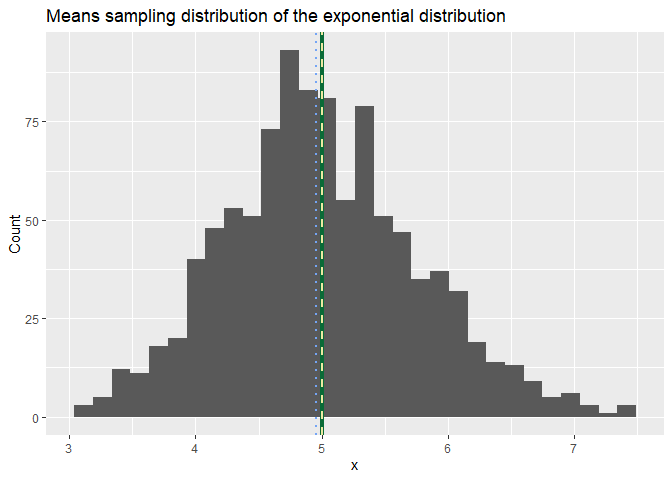
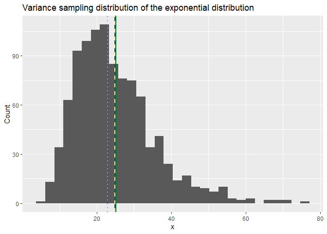

# Synopsis

In this report we aim to describe one application of the law of larger numbers, the central limit theorem (CLT). CLT states that as you increase the sample size for a random variable, the distribution of the sample sums better approximates a normal distribution. Mathematical demonstrations prove it and here we will show it in practice by simulations.

# Simulations : Central Limit Theorem

## Exponential distribution

Exponential distribution is a highly left-skewed, far from being similar to a normal distribution. The probability density function is P(X=x;lambda) = lambda * exp(- lambda * x), with unique parameter lambda. Theory allows us to know about the exponential distribution :  
      - the mean is 1/lambda  
      - the standard deviation is also 1/lambda  

Without understanding the CLT, it could be surprising to see a sampling sum distribution becoming normal from values of an abnormal distribution. However, law of larger numbers (so as CLT) requires a sampling big enough to function properly. For the CLT, one common threshold is 30 values/sample. This simulation will take 40 values/sample for 1000 samples.

### Initialize simulation parameters


```r
lambda <- 0.2
nsamp <- 40
nsimu <- 1000
```

### Initial distributions

In order to explicitly show the left-skewed exponential distribution, 1000 samples of exponential distribution function are shown below.

```r
library(ggplot2)

# Get 1000 random values of the exponential distribution
exp.sim <- rexp(nsimu, lambda)

# Plot the values
qplot(exp.sim,
      main= "1000 sampled values from exponential distribution",
      xlab = "x", ylab = "Count")
```

<!-- -->


## Sample mean vs Theoretical mean

Let's compare the theoretical mean and the mean of the 1000 samples distribution from the mean of 40 exponential distribution values.

```r
# Set random numbers generation reproducible
set.seed(126)

# From theory
mean.theo <- 1/lambda

# From simulation
mean.simu <- replicate(nsimu, expr = mean(rexp(nsamp, lambda)))

# Compare results
print(data.frame(Theorical.mean = mean.theo, Sample.mean = mean(mean.simu), 
                 Sample.median = median(mean.simu), Sample.standard.deviation = sd(mean.simu)))
```

```
##   Theorical.mean Sample.mean Sample.median Sample.standard.deviation
## 1              5     5.00425       4.95466                 0.7662711
```

The two values are extremely close. It was expected regarding the CLT, since the mean is an unbiased statistic. Let's investigate more on the samples distribution.

### Distribution


```r
# Make a histogram of the distribution values and add vertical lines
qplot(mean.simu,
      main = "Means sampling distribution of the exponential distribution",
      xlab='x', ylab = 'Count') +
geom_vline(xintercept = 5, lwd = 1.5, col = '#0A6B37') + 
geom_vline(xintercept = mean(mean.simu), lwd = 1, lty =2, col = '#EEE8A2') +
geom_vline(xintercept = median(mean.simu), lwd = 1, lty =3, col = '#74A5F5')  
```

<!-- -->

Above stands the distribution plot of the sampled means. Three vertical lines were added :  
1. One filled in green intercepting the true value of the exponential distribution mean, 5.  
2. Another dashed in yellow intercepting the mass center of the distribution, which in that case is the mean, ~ 5.00.  
3. Last made out of points in blue intercepting the median of the distribution, ~ 4.95.

The distribution is almost bell-shaped, and values seem symmetrically distributed around the mean. Also the median is very close to the mean distribution, which both are equal in a normal distribution.  

Another element reinforcing normality is the standard deviation of the sampling distribution, ~ 0.77, close to the theoretical value, 1, of a normal distribution.  

All these insights on the means sampling distribution as a normal distribution make a solid assumption.

## Sample variance vs Theoretical variance

Let's compare the theoretical variance and the mean of the 1000 samples distribution from the variance of 40 exponential distribution values.  
Taking the average of the samples variance is relevant only if the distribution follows the CLT and approximates a normal distribution.

```r
# Set random numbers generation reproducible
set.seed(126)

# From theory
var.theo <- (1/lambda)^2

# From simulation
var.simu <- replicate(nsimu, expr = var(rexp(nsamp, lambda)))

# Compare results
print(data.frame(Theorical.variance = var.theo, Sample.variance = mean(var.simu),
                 Sample.median = median(var.simu)))
```

```
##   Theorical.variance Sample.variance Sample.median
## 1                 25        24.83586       22.8235
```

The two values are very close. It was also expected regarding the CLT. Let's investigate more on the samples distribution.

### Distribution


```r
# Make a histogram of the distribution values and add vertical lines
qplot(var.simu,
      main = "Variance sampling distribution of the exponential distribution",
      xlab='x', ylab = 'Count') +
geom_vline(xintercept = 25, lwd = 1.5, col = '#0A6B37') + 
geom_vline(xintercept = mean(var.simu), lwd = 1, lty =2, col = '#EEE8A2') +
geom_vline(xintercept = median(var.simu), lwd = 1, lty =3, col = '#74A5F5')
```

<!-- -->

As previously, above stands the distribution plot of the sampled variance. Three vertical lines were added :  
1. One filled in green intercepting the true value of the exponential distribution variance, 25 (standard deviation squared : 1/lambda²).  
2. Another dashed in yellow intercepting the mass center of the distribution, which in that case is the mean, ~ 24.83.  
3. Last made out of points in blue intercepting the median of the distribution, ~ 22.82.

The distribution is roughly bell-shaped, and values seem roughly symmetrically distributed around the mean. Even if the median is quite close to the mean distribution, the 2 units of difference between them are explained by the skewed right-tail of the distribution. Nevertheless, normality assumption stands.

## Conclusion

Our results show that CLT is respected since the average and variance are extremely close between theory and simulation values. Moreover, their distribution approximate with success normal distribution.

# Exploratory data analysis : tooth growth data

The data set 'ToothGrowth' is aiming to study the effect of vitamin C on tooth growth in 60 guinea pigs. Each animal received one of three dose levels of vitamin C (0.5, 1, and 2 mg/day) by one of two delivery methods, orange juice or ascorbic acid (a form of vitamin C and coded as VC).

## Load the data


```r
library(datasets)

# Load the data
data(ToothGrowth)

# Store the data set in a variable
tooth <- ToothGrowth

# Rename some values to explicit labeling
tooth$supp <- factor(tooth$supp, labels= c("orange juice", "ascorbic acid"))
colnames(tooth) <- c('len', 'delivery.method', 'dose')
```

## Statistics summary

Get the dimensions of the data set and by features.

```r
# Number of rows and columns
dim(tooth)
```

```
## [1] 60  3
```

```r
# Number of observations for the "dose" and "delivery.method" variables
table(tooth$dose, tooth$delivery.method)
```

```
##      
##       orange juice ascorbic acid
##   0.5           10            10
##   1             10            10
##   2             10            10
```

Let's see the 5 first rows of the data set.

```r
head(tooth)
```

```
##    len delivery.method dose
## 1  4.2   ascorbic acid  0.5
## 2 11.5   ascorbic acid  0.5
## 3  7.3   ascorbic acid  0.5
## 4  5.8   ascorbic acid  0.5
## 5  6.4   ascorbic acid  0.5
## 6 10.0   ascorbic acid  0.5
```

Overall statistics on the length of the tooth growth.

```r
# Tukey's five number summary + mean & std
data.frame(Statistic = c('Min', '25th percentile','Median', '75th percentile', 'Max', 'Mean', 'Standard Deviation'),
  Values = c(fivenum(tooth$len), mean(tooth$len), sd(tooth$len)))
```

```
##            Statistic    Values
## 1                Min  4.200000
## 2    25th percentile 12.550000
## 3             Median 19.250000
## 4    75th percentile 25.350000
## 5                Max 33.900000
## 6               Mean 18.813333
## 7 Standard Deviation  7.649315
```

Now, let's see the length of tooth growth discriminated by other variable in a plot.

```r
ggplot(data = tooth, aes(dose, len, color = delivery.method), ) +
      geom_point(size = 3, alpha = 1/2) + 
      geom_smooth(method = "lm", alpha =1/2, show.legend = F)  +
      labs(title = "Tooth growth length by dose and by vitamin C delivery method",
           x = "Dose levels (mg/day)", y = "Tooth growth length")
```

<!-- -->

The plot is showing all data points and a linear regression of the length function of the dose levels for each vitamin C delivery method.

## Hypothesis testing

Two hypothesis are set :  
      1. Whatever the delivery method, tooth growth length is increasing as the increase of the dose levels.  
      2. For both 0.5 and 1.0 mg/day dose levels delivery method is more effective with the orange juice.
      
### Length increase with dose levels

In order to reduce the amount of calculations, we'll only focus on dose levels 0.5 and 2.0 mg/day. In that sense :  
      * Null hypothesis, H0 : means of the length variable are equal, mu_2.0 - mu_0.5 = 0
      * Alternative hypothesis, Ha : means of the length variable are different, mu_2.0 - mu_0.5 > 0

we assume the normality of the distribution of length variable on both dose levels, also as the independence between subjects. Similar variation is observed between the two groups.   
A t-test will be conducted.


```r
g2 <- tooth$len[tooth$dose == 2] 
g1 <- tooth$len[tooth$dose == 0.5]

t.test(g2-g1, var.equal = TRUE, alternative = "greater")
```

```
## 
## 	One Sample t-test
## 
## data:  g2 - g1
## t = 11.291, df = 19, p-value = 3.595e-10
## alternative hypothesis: true mean is greater than 0
## 95 percent confidence interval:
##  13.12216      Inf
## sample estimates:
## mean of x 
##    15.495
```

Even if t-test's results explicitly state that the null hypothesis is rejected, the related p-value less than 0.01 and the 95% confidence interval of the means difference not including 0 confirm H0 rejection.  

In conclusion, whatever the delivery method, tooth growth length is higher with a 2.0 mg/day dose level than a 0.5 mg/day dose level.

### Greater length with on delivery method

In order to reduce the amount of calculations, we'll only focus on dose level 1.5 mg/day. Data on the 1.0 mg/day dose level by delivery method overlap on each other but still seems to be enough differentiated, let's investiguate. In that sense :  
      * Null hypothesis, H0 : means of the length variable are equal, mu_orange.juice - mu_ascorbic.acid = 0
      * Alternative hypothesis, Ha : means of the length variable are different, mu_orange.juice - mu_ascorbic.acid > 0

we assume the normality of the distribution of length variable on both dose levels, also as the independence between subjects. Similar variation is observed between the two groups.   
A t-test will be conducted.


```r
g2 <- tooth$len[tooth$dose == 1 & tooth$delivery.method == "orange juice"] 
g1 <- tooth$len[tooth$dose == 1 & tooth$delivery.method == "ascorbic acid"]

t.test(g2-g1, var.equal = TRUE, alternative = "greater")
```

```
## 
## 	One Sample t-test
## 
## data:  g2 - g1
## t = 3.3721, df = 9, p-value = 0.004115
## alternative hypothesis: true mean is greater than 0
## 95 percent confidence interval:
##  2.706401      Inf
## sample estimates:
## mean of x 
##      5.93
```

Again, even if t-test's results explicitly state that the null hypothesis is rejected, the related p-value less than 0.01 and the 95% confidence interval of the means difference not including 0 confirm H0 rejection.  

In conclusion, for a 1.0 mg/day dose level, tooth growth length is higher with orange juice vitamin C delivery method than ascorbic acid vitamin C delivery method.
